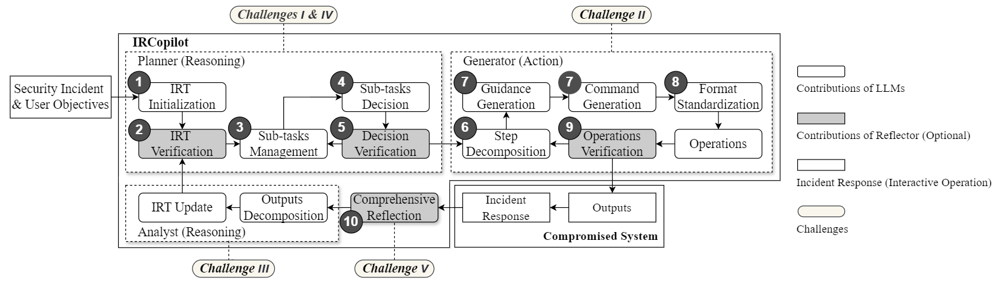

# 👋 IRCopilot: Automated Incident Response with Large Language Models

Source code for paper "IRCopilot: Benchmarking and Augmenting Large Language Models for Incident Response".

---

## 📖 Overview

**IRCopilot** is structured into three cognitive stages: **Reasoning**, **Action**, and **Reflection**.

1.  **Reasoning**: The *Planner* and *Analyst* maintain the Incident Response Tree (IRT) and tackle reasoning challenges step-by-step.
2.  **Action**: The *Generator* distributes and generates guidance and commands.
3.  **Reflection**: The *Reflector* addresses challenges posed by hallucination and privacy risks.

  
   
  <em>Figure 1: Workflow of IRCopilot.</em>

---

## 📂 Resources

- **Prompt**: Available at [Prompt of IRCopilot](./prompt_class_IRCopilot_en.py).
- **Code**: Available at [code](./IRCopilot/).
- **Paper Materials**:
  - [Global Cybersecurity Landscape](./Global%20Cybersecurity%20Landscape.pdf)
  - [Failure Case Analysis](./Case%20Analysis.pdf)

---

## 🏆 IRBench
Click on the **Target Name** to view the sub-task list.

| ID | Target Name | Difficulty | OS | Tasks | Release | Source |
| :---: | :--- | :---: | :---: | :---: | :---: | :--- |
| 1 | [**Investigating Windows**](./IRBench/1_TryHackMe_InvestigatingWindows%20(Easy).md) | 🟢 Easy | 🪟 Win | 22 | 2018-12-10 | [TryHackMe](https://tryhackme.com/r/room/investigatingwindows) |
| 2 | [**Linux 1**](./IRBench/2_ZGSF_Linux1%20(Easy).md) | 🟢 Easy | 🐧 Linux | 7 | 2024-03-19 | [ZGSF](https://pan.quark.cn/s/4b6dffd0c51a) |
| 3 | [**Web 1**](./IRBench/3_ZGSF_Web1%20(Easy).md) | 🟢 Easy | 🪟 Win | 7 | 2024-02-27 | [ZGSF](https://pan.quark.cn/s/4b6dffd0c51a) |
| 4 | [**Tardigrade**](./IRBench/4_TryHackMe_Tardigrade%20(Medium).md) | 🟡 Medium | 🐧 Linux | 15 | 2023-02-24 | [TryHackMe](https://tryhackme.com/r/room/tardigrade) |
| 5 | [**VulnTarget n Ransomware**](./IRBench/5_XuanJI_VulnTarget-n-Ransomware%20(Medium).md) | 🟡 Medium | 🐧 Linux | 6 | 2024-06-01 | [XuanJi](https://xj.edisec.net/challenges/84) |
| 6 | [**Web 2**](./IRBench/6_ZGSF_Web2%20(Medium).md) | 🟡 Medium | 🪟 Win | 11 | 2024-02-29 | [ZGSF](https://pan.quark.cn/s/4b6dffd0c51a) |
| 7 | [**Web 3**](./IRBench/7_ZGSF_Web3%20(Medium).md) | 🟡 Medium | 🪟 Win | 11 | 2024-03-12 | [ZGSF](https://pan.quark.cn/s/4b6dffd0c51a) |
| 8 | [**Windows Black Pages & Tampering**](./IRBench/8_XuanJI_Windows%20Black%20Pages%20&%20Tampering%20(medium).md) | 🟡 Medium | 🪟 Win | 10 | 2024-01-02 | [XuanJi](https://xj.edisec.net/challenges/51) |
| 9 | [**Windows Miner**](./IRBench/9_ZGSF_WindowsMiner%20(Medium).md) | 🟡 Medium | 🪟 Win | 9 | 2024-05-22 | [ZGSF](https://pan.quark.cn/s/4b6dffd0c51a) |
| 10 | [**Linux 2**](./IRBench/10_ZGSF_Linux2%20(Hard).md) | 🔴 Hard | 🐧 Linux | 11 | 2024-04-15 | [ZGSF](https://pan.quark.cn/s/4b6dffd0c51a) |
| 11 | [**Nacos Memory Trojan**](./IRBench/11_XuanJI_Nacos%20(hard).md) | 🔴 Hard | 🐧 Linux | 6 | 2023-12-07 | [XuanJi](https://xj.edisec.net/challenges/34) |
| 12 | [**Where 1S tHe Hacker**](./IRBench/12_XuanJI_Where-1S-tHe-Hacker%20(hard).md) | 🔴 Hard | 🪟 Win | 15 | 2024-03-13 | [XuanJi](https://xj.edisec.net/challenges/63) |
| **Sum** | | | | **130** | | |

### 🧩 Summarized 27 Types of Sub-tasks in IRBench

| Phase | Technique | Description |
| :--- | :--- | :--- |
| **🕵️Detection** | System Information Gathering             | Includes operating system identification, network configuration analysis, hardware information gathering, etc.                |
|               | Open Port Identification                 | Detects open network ports on the target system.                                                                              |
|               | Service Enumeration                      | Identifies and analyzes running services to uncover version details and vulnerabilities.                                      |
|               | Directory Inspection                     | Examines key directories and hidden files for unusual activity.                                                               |
|               | Account Security Review                  | Audits user account permissions and identifies unauthorized accounts or backdoors.                                            |
|               | File Integrity Check                     | Monitors file hashes to detect unauthorized changes.                                                                          |
|               | Other Detections                         | Inspects other vulnerable areas of the system, such as the registry, etc.                                                     |
| **🛡️Response**  | Historical Command and Behavior Analysis | Reviews user commands and system behaviors to detect abnormal operations.                                                     |
|               | Permission Review and Management         | Audits system and application permissions to enforce least-privilege principles and manages risky permissions.                |
|               | File Analysis                            | Inspects system files and source code for vulnerabilities or malicious content.                                               |
|               | Malicious File Handling                  | Identifies, isolates, and removes malicious files to prevent further damage.                                                  |
|               | Startup Item Analysis                    | Reviews startup items for unauthorized programs or scripts.                                                                   |
|               | Scheduled Task Analysis                  | Analyzes the system's scheduled tasks settings to identifies possible malicious or planned tasks.                             |
|               | Anomaly Behavior Response                | Responds to abnormal system or user behaviors to contain potential threats.                                                   |
|               | Memory and Process Analysis              | Examines memory and processes to identify abnormal or malicious activity.                                                     |
|               | Malicious Process Handling               | Terminates malicious processes to mitigate ongoing threats.                                                                   |
|               | System Log Analysis                      | Analyzes system logs for signs of compromise, unauthorized access, or suspicious activities.                                  |
|               | Application Log Analysis                 | Reviews application logs for exploitation attempts or unusual behavior.                                                       |
|               | Network Traffic Analysis                 | Analyzes network traffic to identify suspicious communication or data exfiltration.                                           |
|               | Risky IP Management                      | Blocks or monitors traffic from known malicious or suspicious IP addresses.                                                   |
|               | Database Analysis                        | Analyzes databases for security vulnerabilities, data leaks, or unauthorized access.                                          |
|               | Other Responses                          | Conducts additional response activities, such as analyzing virtualization environments or reviewing container security.       |
| **🩹Recovery**  | System Recovery                          | Restores the system to a stable state after failures, malware, or misconfigurations.                                          |
|               | Data Recovery                            | Recovers lost or corrupted data from backups or damaged media.                                                                |
|               | Service Recovery                         | Restores key services and applications to minimize downtime.                                                                  |
|               | Vulnerability Patching                   | Applies patches to fix vulnerabilities and prevents recurrence of attacks.                                                    |
|               | Other Recoveries                         | Additional recovery methods, such as network recovery and permission reset, to address various aspects of system restoration. |

### 📊 IRBench Difficulty Standard

| Score | Level | Description | Example |
| :---: | :---: | :--- | :--- |
| 🟢1 | Easy | Steps are clear and simple, can be completed quickly. Typically no extra tools are required; relies on common system utilities. | Run `netstat` or `tasklist` on a Windows host to list active network connections and processes. |
| 🟢2 | Easy | Requires basic security knowledge and a brief period of analysis; some scenarios may need specialized tools. | Use a PowerShell script or `grep` to filter SSH login failures from system logs over the past hour and export the list of suspicious IPs. |
| 🟢3 | Easy | Combines elements of levels 1 and 2 or requires some IR theory; involves static analysis of malicious code and basic programming skills. | Extract a `Base64-encoded` suspicious script and use a static analysis tool to inspect its unpacked core functionality. |
| 🟡4 | Medium | Builds on the above, requiring writing scripts or complex commands, and the ability to learn and adapt quickly. | Write a script to extract key events from multiple `log sources (such as operating system logs, security audit logs, and network device logs)` and analyze them. |
| 🟡5 | Medium | Targets are diverse and hard for a single analyst to cover; requires team collaboration and in-depth study of security principles and code vulnerabilities. | Cross-correlate anomalous login events with large-scale outbound `traffic` events to pinpoint potential lateral movement paths. |
| 🟡6 | Medium | Demands systematic learning and long-term effort on specific targets, rigorously testing an analyst’s deep knowledge and hands-on experience. | In a Windows environment, batch-extract and parse complex `event IDs (e.g., 4624, 4688, 5156)` from security logs, standardize key fields, and correlate across hosts using user, process, and network data. |
| 🔴7 | Hard | Requires continuous learning and practice to keep pace with evolving techniques and progressively meet higher difficulty challenges. | In-depth static and dynamic analysis. |
| 🔴8 | Hard | Attack has penetrated the application-framework layer; demands comprehensive analysis and hardening of the entire framework. | Detect and remove `memory-resident backdoors (memory horses)` and patch affected framework components to secure inter-component calls. |
| 🔴9 | Hard | Attack has reached the operating-system level; requires integrating multi-source data for systematic analysis, possibly involving 0day research/exploit. | On a compromised Windows Server, detect and track implanted cryptomining or ransomware processes, correlate event logs, network traffic, and registry changes, then locate and remove persistence mechanisms. |
| 🔴10 | Hard | Targets low-level architecture (e.g., CPU kernel or chip); involves reverse engineering, large-scale binary analysis, and hardware-level security research. | Reverse-engineer firmware or kernel modules to identify microarchitecture or hardware side-channel vulnerabilities, then design microcode or firmware-level mitigations or patches.  |

---

## ⚖️ Data Contamination Mitigation

> [**Have LLMs been trained on benchmark tests or writeups?**](./Have%20LLMs%20been%20trained%20on%20benchmark%20tests%20or%20writeups)

We recognize that cases or writeupsmay be included in LLM training data. To mitigate this bias:

1.  We prioritized cases published **after** the LLMs' knowledge cutoff dates. As shown below, **33/72 (Majorities)** tasks are post-cutoff.
2.  We queried LLMs for specific details to confirm lack of prior knowledge.
3.  IRCopilot's transparent reasoning steps confirmed no memorized solutions were used.

### Comparison: IRBench Dates vs. LLM Cutoff

| Model | **GPT-4** | **DeepSeek-V3** | **GPT-4o** | **Claude-3.5** | **GPT-o1** | | **Total** |
| :--- | :---: | :---: | :---: | :---: | :---: | :---: | :---: |
| **Cutoff** | 2023-04        | 2024-07         | 2023-10         | 2024-04       | 2023-10         | | |
| **After** | 10           | 0               | 10              | 3             | 10              | | **33** |
| **Before** | 2           | 12              | 2               | 9             | 2               | | **27** |

#### Detailed Cutoff Check
|     |                                                                                                                        | **LLM**                   | GPT-4     | Llama3-70b | DeepSeek-V3 | GPT-4o    | Claude-3.5-Sonnet | GPT-o1    |
| --- | ---------------------------------------------------------------------------------------------------------------------- | ------------------------- | --------- | --------- | ----------- | --------- | ----------------- | --------- |
|     | **Benchmark**                                                                                                          | **Knowledge Cutoff Date** | (2023-04) | (2023-12) | (2024-07)   | (2023-10) | (2024-04)         | (2023-10) |
| 1   | [Investigating Windows](./IRBench/1_TryHackMe_InvestigatingWindows%20(Easy).md)                          | (2018-12-10)              | ×         | ×         | ×           | ×         | ×                 | ×         |
| 2   | [Linux 1](./IRBench/2_ZGSF_Linux1%20(Easy).md)                                                               | (2024-03-19)              | ✓         | ✓         | ×           | ✓         | ×                 | ✓         |
| 3   | [Web 1](./IRBench/3_ZGSF_Web1%20(Easy).md)                                                                   | (2024-02-27)              | ✓         | ✓         | ×           | ✓         | ×                 | ✓         |
| 4   | [Tardigrade](./IRBench/4_TryHackMe_Tardigrade%20(Medium).md)                                                | (2023-02-24)              | ×         | ×         | ×           | ×         | ×                 | ×         |
| 5   | [VulnTarget n Ransomware](./IRBench/5_XuanJI_VulnTarget-n-Ransomware%20(Medium).md)                         | (2024-06-01)              | ✓         | ✓         | ×           | ✓         | ✓                 | ✓         |
| 6   | [Web 2](./IRBench/6_ZGSF_Web2%20(Medium).md)                                                                 | (2024-02-29)              | ✓         | ✓         | ×           | ✓         | ×                 | ✓         |
| 7   | [Web 3](./IRBench/7_ZGSF_Web3%20(Medium).md)                                                                 | (2024-03-12)              | ✓         | ✓         | ×           | ✓         | ×                 | ✓         |
| 8   | [Windows Black Pages & Tampering](./IRBench/8_XuanJI_Windows%20Black%20Pages%20&%20Tampering%20(medium).md) | (2024-01-02)              | ✓         | ✓         | ×           | ✓         | ×                 | ✓         |
| 9   | [Windows Miner](./IRBench/9_ZGSF_WindowsMiner%20(Medium))                                                | (2024-05-22)              | ✓         | ✓         | ×           | ✓         | ✓                 | ✓         |
| 10  | [Linux 2](./IRBench/10_ZGSF_Linux2%20(Hard).md)                                                              | (2024-04-15)              | ✓         | ✓         | ×           | ✓         | ✓                 | ✓         |
| 11  | [Nacos Memory Trojan](./IRBench/11_XuanJI_Nacos%20(hard).md)                                     | (2023-12-07)              | ✓         | ✓         | ×           | ✓         | ×                 | ✓         |
| 12  | [Where 1S tHe Hacker](./IRBench/12_XuanJI_Where-1S-tHe-Hacker%20(hard).md)                                  | (2024-03-13)              | ✓         | ✓         | ×           | ✓         | ×                 | ✓         |
|     |                                                                                                                        |                           |           |            |             |           |                   |           |
|     | (after✓ : predate ×)                                                                                                   | **Total 43:29**           | 10:2      | 10:2      | 0:12        | 10:2      | 3:9               | 10:2      |

*(✓ indicates the benchmark was released AFTER the model's knowledge cutoff.)*
